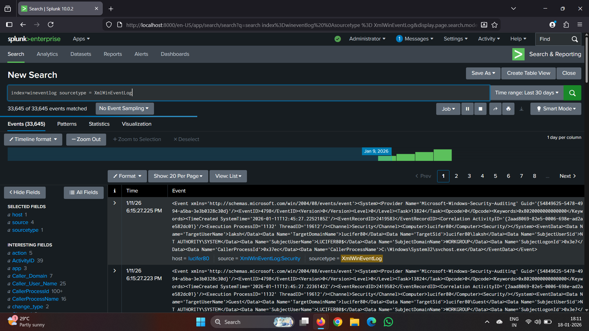
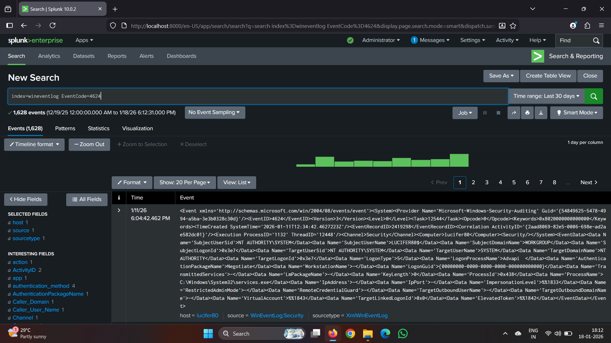
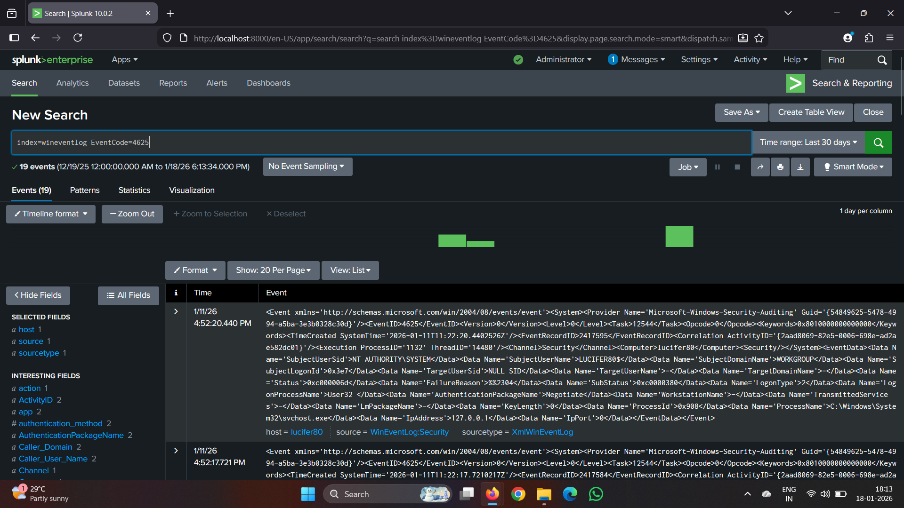
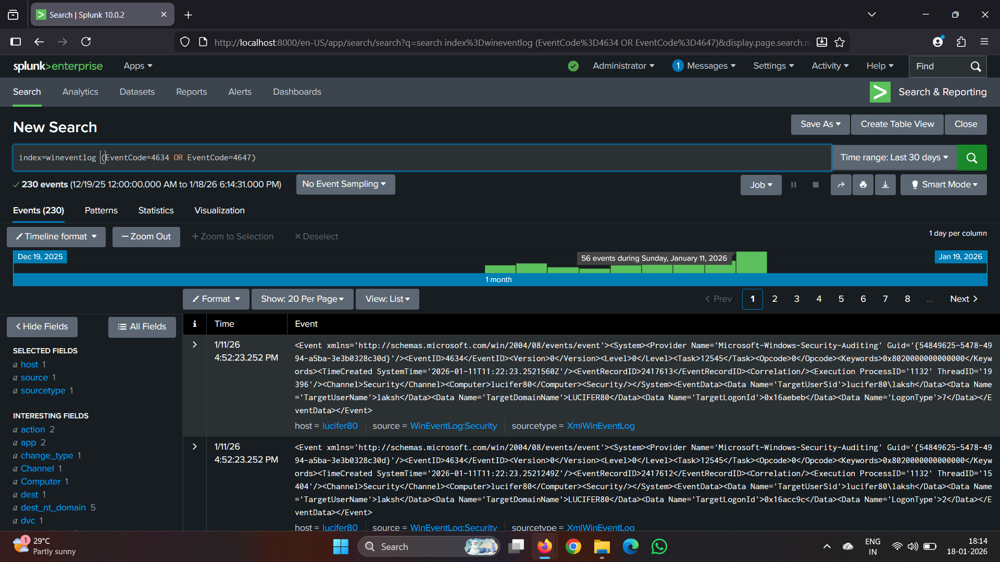
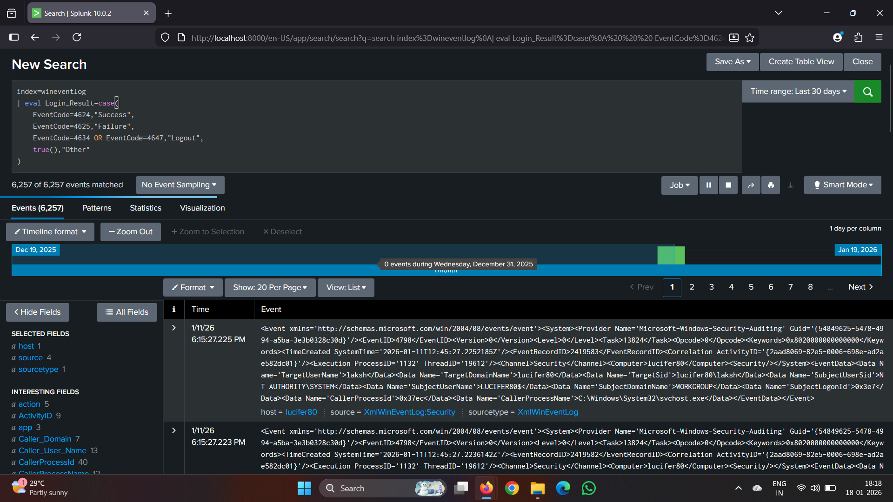
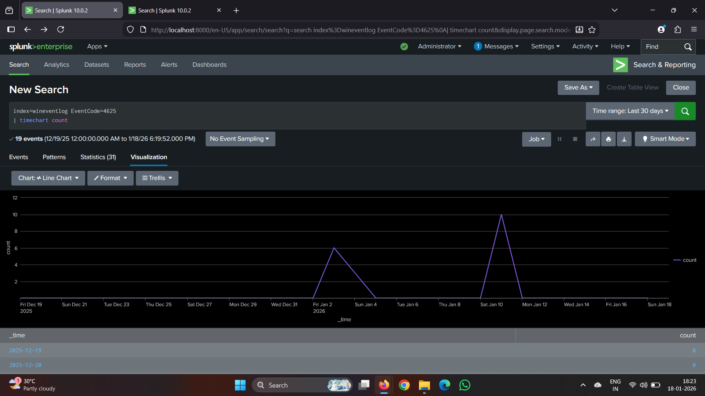
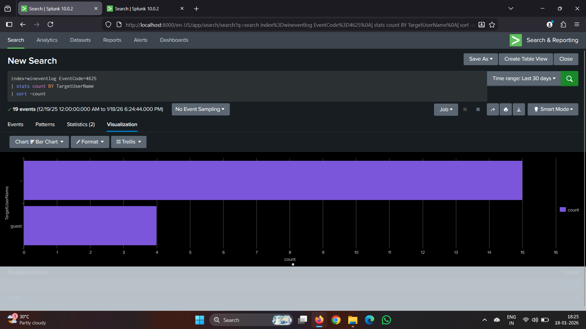
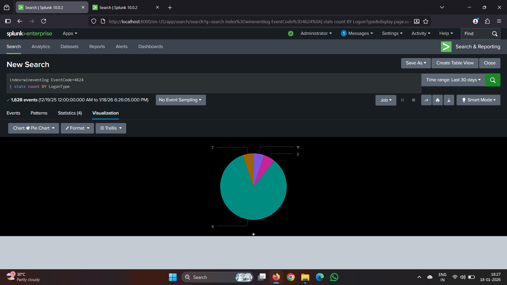
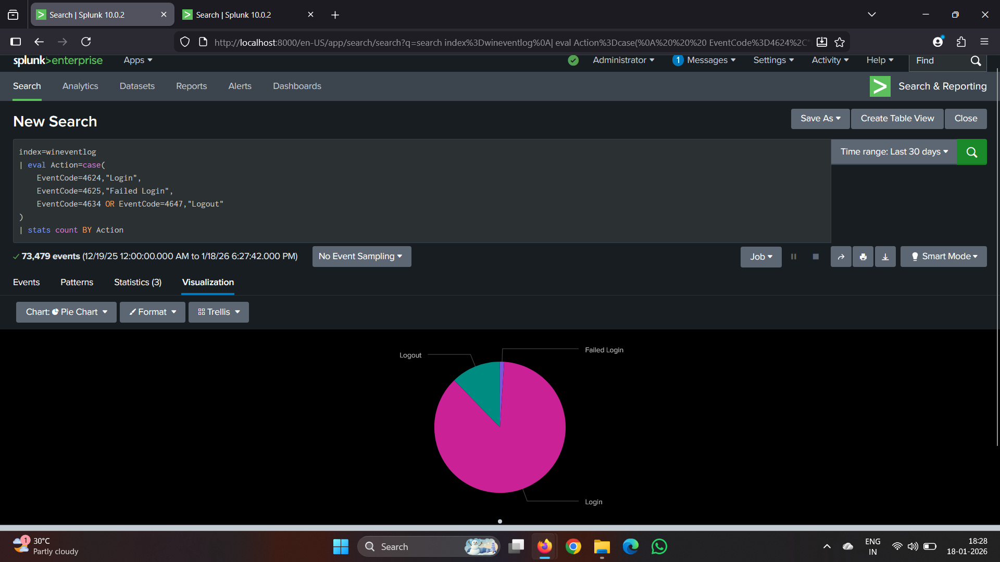
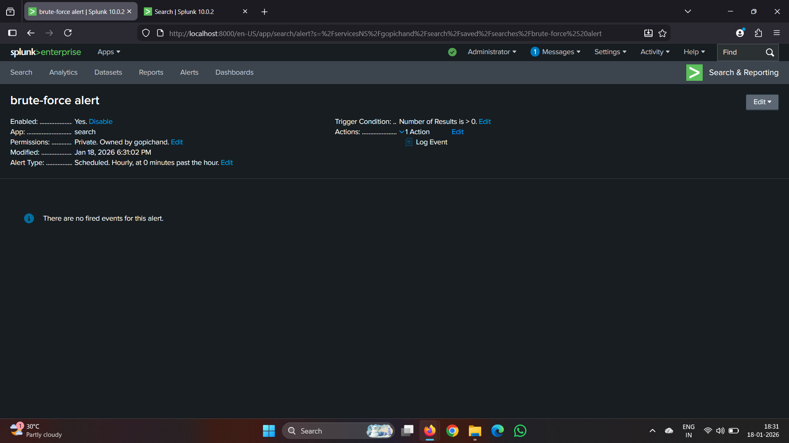

 splunk-login-monitoring-soc

 ## Windows Login & Logout Monitoring – SOC Analyst Project:

 Project Overview
This project demonstrates a real-world **SOC (Security Operations Center) use case** by monitoring Windows authentication activity using **Splunk SIEM**. The project focuses on detecting suspicious login behavior, identifying brute-force attacks, and visualizing authentication trends through dashboards and alerts.

## Project Objectives
- Monitor Windows login and logout activities
- Detect failed login attempts and brute-force behavior
- Analyze authentication patterns and user behavior
- Create SOC-style dashboards and alerts in Splunk

---

## Tools & Technologies
- Splunk Enterprise (Free Edition)
- Splunk Universal Forwarder
- Windows Security Event Logs
- Windows 10 / 11 Operating System

---

## Log Sources & Event Codes
This project analyzes **Windows Security logs**, focusing on key authentication-related event IDs:

| Event ID | Description           |
|--------  |-----------------------|         
| 4624     | Successful login      |
| 4625     | Failed login          |
| 4634     | User logoff           |
| 4647     | User-initiated logoff |

---

## Dashboards Created
- Failed login attempts over time
- Top targeted user accounts
- Login types (Interactive, Network, RDP, Service)
- Login vs Logout activity comparison

These dashboards provide SOC analysts with quick visibility into authentication anomalies.

---

## Alerts Implemented
**Brute-Force Login Detection Alert**
- Triggers when a user account has multiple failed login attempts within a short time window
- Helps detect credential stuffing and password-guessing attacks

---

## Skills Demonstrated
- Windows authentication and auditing concepts
- SIEM log ingestion and normalization
- SPL (Search Processing Language)
- Security dashboards and visualizations
- Alert creation and threshold-based detection
- SOC investigation and monitoring workflows

---

##  Project Deliverables
- SPL queries
- Dashboards (JSON / screenshots)
- Alert configurations
- Documentation and analysis

  -------
## 📸 Screenshots

### 🔍 Log Ingestion & Authentication Events

##1

##2

##3

### 🧠 Data Enrichment & Analysis

##6

##7

##8

##9

### 🚨 Alert – Brute Force Detection

